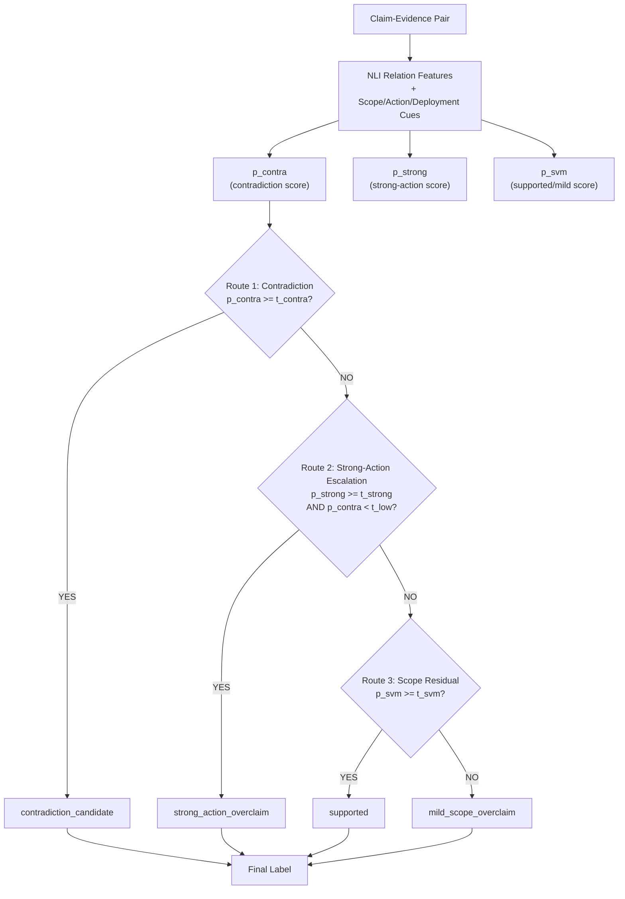

# Figure 1: CESE-OCN R4 Method Flow

**Purpose:** Show the three-route architecture of R4 and why the routing order matters. Insert into §IV.B of the main paper.

## Mermaid version



## ASCII version (fallback)

```
                +---------------------------+
                |   Claim-Evidence Pair     |
                +-------------+-------------+
                              |
                              v
        +-------------------------------------+
        |  NLI relation features             |
        |  + scope/action/deployment cues    |
        +-------------------------------------+
                              |
       +------------+---------+---------+------------+
       |                      |                     |
       v                      v                     v
  p_contra                 p_strong                p_svm
  (contradiction)         (strong-action)         (supported/mild)
       |                      |                     |
       v                      v                     v
+--------------+    +-------------------+    +---------------+
| Route 1:     |    | Route 2:          |    | Route 3:      |
| if p_contra  |    | if p_strong>=t_s  |    | if p_svm>=t_v |
| >= t_contra  |    | AND p_contra<t_l  |    |   supported   |
| -> contra    |    | -> strong_action  |    | else          |
|              |    |                   |    |   mild_scope  |
+------+-------+    +---------+---------+    +-------+-------+
       |                      |                     |
       +------+-------+-------+------+-------+------+
              |       |       |      |
              v       v       v      v
         +-----------------------------------+
         |            Final Label            |
         +-----------------------------------+
```

## Routing order rationale

1. **Route 1 (Contradiction first).** Contradiction is the most separable relation in the pilot data; NLI signals capture it well. Handling it first prevents downstream routes from absorbing contradiction cases into strong_action or mild.

2. **Route 2 (Strong-action escalation under a conservative guard).** Strong-action is the most consequential but hardest to detect. The strong-action expert uses action-gap features in addition to NLI. The conservative guard (`p_contra < t_low`) prevents contradiction cases from being absorbed into strong_action — critical because strong_action and contradiction can look similar to a strong-action expert.

3. **Route 3 (Scope-calibration residual).** Supported vs. mild_scope_overclaim is the residual scope-calibration problem, handled last because it is the least separable boundary (supported-F1 = 0.4424, mild-F1 = 0.1266 — the weakest boundary in the taxonomy).

## Frozen thresholds (means over 10 seeds)

| Threshold | Value | Role |
| --- | --- | --- |
| `t_contra` | 0.48 | Route 1: contradiction decision |
| `t_strong` | 0.535 | Route 2: strong-action decision |
| `t_low` | (lower contradiction guard) | Route 2: prevents contradiction absorption |
| `t_svm` | 0.51 | Route 3: supported/mild decision |

## Design choice: relation-specific, not flat

The pilot results show that a single flat four-class classifier conflates these signals and under-performs on the most consequential class (baseline strong-F1 = 0.2408). R4 routes each pair through the most separable relation first, then the most consequential under a conservative guard, then the residual scope calibration — meeting all 5 pre-specified constraints simultaneously (strong_positive_delta ≥ +0.05, flat4_macro_delta ≥ -0.02, contradiction_positive_delta ≥ -0.03, escalation_macro_delta ≥ -0.03, positive_delta_seed_count ≥ 7).
