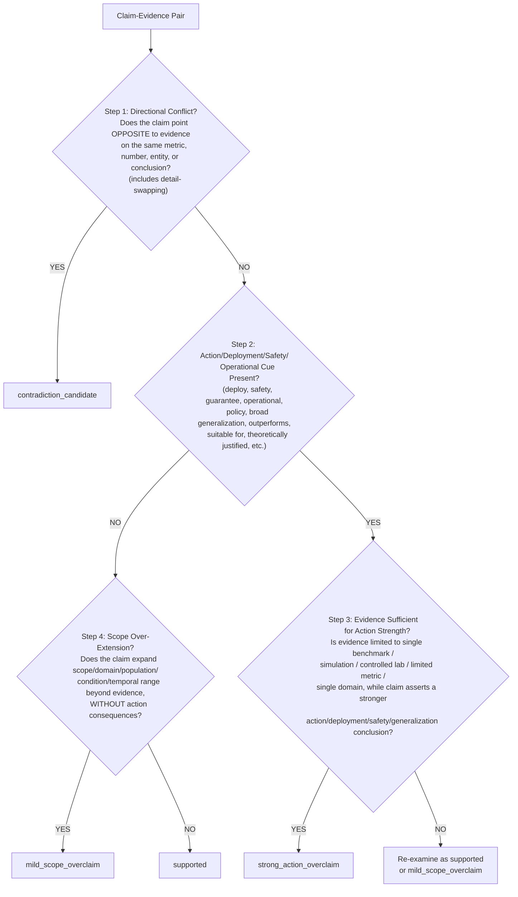

# Figure 2: Taxonomy Decision Tree

**Purpose:** Provide an operational, reproducible procedure for assigning one of four evidence-sufficiency labels to a claim-evidence pair. Insert into §III.B of the main paper. This is the simplified paper version; the full operational version with cue lists and boundary-case rules is in `taxonomy_boundary_decision_tree.md` (V3.4).

## Mermaid version



## ASCII version (fallback)

```
                       +---------------------------+
                       |   Claim-Evidence Pair     |
                       +-------------+-------------+
                                     |
                                     v
              +----------------------------------------+
              | Step 1: Directional Conflict?         |
              | Does the claim point OPPOSITE to      |
              | evidence on the same metric, number,  |
              | entity, or conclusion?                |
              | (includes detail-swapping)            |
              +-----------------+---------------------+
                          YES   |   NO
                +---------------+   +---------------+
                v                               v
        +----------------+        +-----------------------------+
        | contradiction_ |        | Step 2: Action/Deployment/  |
        | candidate      |        | Safety/Operational Cue?     |
        +----------------+        | (deploy, safety, guarantee, |
                                  | operational, policy, broad   |
                                  | generalization, outperforms, |
                                  | suitable for, theoretically  |
                                  | justified, etc.)             |
                                  +--------------+--------------+
                                          YES    |    NO
                                  +--------------+   +--------------+
                                  v                              v
                       +-------------------------+   +-----------------------+
                       | Step 3: Evidence        |   | Step 4: Scope         |
                       | Sufficient for Action   |   | Over-Extension?       |
                       | Strength?               |   | Does the claim expand |
                       | Is evidence limited to  |   | scope/domain/         |
                       | single benchmark /      |   | population/condition/ |
                       | simulation / lab /      |   | temporal range beyond |
                       | limited metric / single |   | evidence, WITHOUT     |
                       | domain, while claim     |   | action consequences?  |
                       | asserts stronger        |   +-------+---------------+
                       | action conclusion?      |    YES    |    NO
                       +-----------+-------------+   +--------+   +--------+
                              YES   |   NO            v           v
                       +------------+   +----------+ +--------+ +--------+
                       v                v          | mild_   | |        |
                +--------------+  +------------+    | scope_  | | sup-   |
                | strong_      |  | Re-examine |    | over-   | | ported |
                | action_      |  | as sup.    |    | claim   | |        |
                | overclaim    |  | or mild    |    +---------+ +--------+
                +--------------+  +------------+
```

## Four labels (core definitions)

| Label | Core Definition |
|---|---|
| **supported** | Evidence is sufficient for the claim's stated strength (not "absolutely true"). |
| **mild_scope_overclaim** | Claim mildly over-extends scope/domain/generality, but no action/deployment/safety conclusion asserted. |
| **strong_action_overclaim** | Claim asserts an action/deployment/safety/guarantee/operational/policy conclusion that evidence cannot justify. Direction may be consistent; strength is excessive. |
| **contradiction_candidate** | Evidence contradicts the claim; directions conflict on the same metric or conclusion (including detail-swapping). |

## Key distinctions operationalized by this tree

1. **strong_action_overclaim does not require directional conflict.** The claim may align with evidence direction, but its *strength* (action/deployment/safety assertion) exceeds what the evidence warrants.
2. **contradiction_candidate is about directional conflict** on the same metric/number/entity, including detail-swapping (e.g., evidence says "6 systems", claim says "8 systems"; evidence says "IPPO and PQN", claim says "PPO-RNN and SAC").
3. **strong_action_overclaim is about strength/action consequences**, not scope breadth alone.
4. **mild_scope_overclaim is about scope/generalization over-extension** without action/deployment/safety consequences.
5. **supported means evidence is sufficient for the claim's stated strength**, not that the claim is "absolutely true."

## Boundary cases (where the tree yields ambiguous results)

- **Mild vs. Strong (hardest boundary, 12/25 audit cases):** A claim with *some* scope expansion *and* *some* action framing, but neither dominant. Flag as boundary case.
- **Strong vs. Contradiction (6/25 audit cases):** Number inflation (e.g., 90%→95%) could be read as contradiction (factual mismatch) or strong_action (strength inflation). The tree treats number inflation as contradiction (Step 1).
- **Claim too abstract (5/25 audit cases):** A claim that describes what the paper does ("presents", "evaluates") without explicit action language. The tree may route to Step 4, but the silver label may be strong_action if the claim's framing implies significance beyond evidence.
- **Evidence too short / context missing:** The decision tree cannot compensate for missing context. Flag as boundary case.

Boundary cases are not noise to hide — they are the cases where evidence sufficiency calibration is hardest and most consequential. They are retained in `high_risk_sample_bank.csv` as future gold adjudication priority.

## What this decision tree is NOT

- **Not a gold standard.** It is a labeling aid.
- **Not validated against gold labels.** No gold labels exist for the four-class taxonomy; the tree has not been tested against external adjudication.
- **Not a replacement for human judgment.** Cases where the tree yields ambiguous results still require human adjudication.
